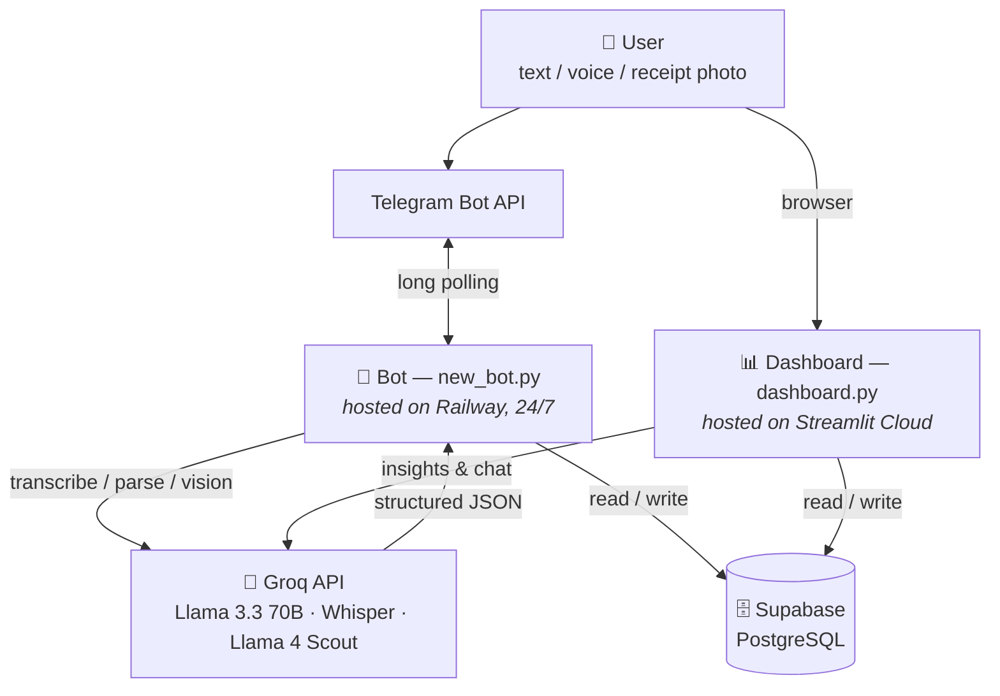

# Expense Tracker — Telegram Bot + Analytics Dashboard

A Hebrew-language personal finance system. Users log expenses by sending a Telegram
message, a voice note, or a photo of a receipt — an LLM parses each one into structured
data, and a Streamlit dashboard turns it into charts, budgets and AI-generated insights.

Built and maintained as a real, in-use system (not a demo): it runs 24/7 and is used
daily by a small group of people.

---

## Architecture

Three components running in three places, connected only through a shared database.



The bot and the dashboard never talk to each other directly — the database is the only
integration point. Either can go down without taking the other with it.

**Request flow for a text message:**

1. User sends `קפה 15 שקל` ("coffee, 15 shekels") in Telegram.
2. The bot authorizes the sender against the `authorized_users` table.
3. The message is sent to Groq with a constrained prompt.
4. The model returns `{"amount": 15, "category": "אוכל ושתייה", "item": "קפה"}`.
5. The result is validated, written to `expenses`, and confirmed back to the user with
   inline buttons (edit / delete / assign to a shared group).
6. The dashboard reads the same table on next load.

Voice notes are transcribed with Whisper first; receipt photos are base64-encoded and
sent to a vision model. Both then follow the identical parse-validate-store path.

---

## Features

**Bot**
- Expense logging from free-text, voice, or receipt photos
- Inline editing of amount / category / item, and deletion
- Monthly and weekly reports
- Recurring expenses with daily reminders and one-tap confirmation
- Shared group expenses with member notifications
- Budget threshold alerts at 90% and 100%
- Password-gated access with attempt limiting

**Dashboard**
- Overview with month-over-month comparison and a computed insight banner
- Trend charts (daily / weekly / monthly granularity)
- Editable expense table with bulk delete and PDF export
- Per-category monthly budgets with usage visualization
- Shared-group view with automatic debt settlement calculation
- AI insights and a free-form chat over your own spending data
- Light / dark theme, RTL layout, mobile-responsive

**Scheduled jobs** (via `python-telegram-bot`'s built-in `JobQueue`)
- Daily recurring-expense reminders at 09:00 Asia/Jerusalem
- Monthly summary on the last day of the month
- Automatic budget carry-over on the 1st of each month
- Hourly safety net that backfills anything missed while the bot was down

---

## Tech stack and why

| Component | Choice | Rationale | Trade-off |
|---|---|---|---|
| Interface | Telegram Bot API | No app to build or install; users already have it | Locked into Telegram's ecosystem |
| LLM | Groq (Llama 3.3 70B, Whisper, Llama 4 Scout) | Free tier, very low latency | Dependent on free-tier rate limits |
| Database | Supabase (PostgreSQL) | Managed Postgres, simple Python client, no server ops | Free-tier limits |
| Bot hosting | Railway | Runs a true 24/7 worker process, deploys on git push | Free-tier credit limits |
| Dashboard | Streamlit | Full dashboard in pure Python — no JS/React needed | Sleeps when idle; re-runs the whole script per interaction |

---

## Engineering notes

Three problems that shaped the design.

**Reliable reminders on unreliable infrastructure.**
A daily 09:00 reminder is lost if the bot happens to be down at that moment — but a
retry loop risks spamming the same reminder repeatedly. The solution combines three
pieces: a scheduled daily job, an hourly safety net that also runs on startup, and a
`last_reminded` column storing the current month. Every send checks that column first.
The result is at-least-once scheduling with deduplication, which yields exactly-once
delivery in practice.

**Scheduling inside an existing event loop.**
Reminders originally used APScheduler as a separate scheduler, which silently never
fired — it wasn't integrating with the asyncio event loop that `python-telegram-bot`
owns. Switching to the library's built-in `JobQueue`, which runs inside that same loop,
made scheduling reliable.

**Keeping a sleeping dashboard awake.**
Streamlit Community Cloud only counts live websocket sessions as activity, so plain HTTP
pings don't prevent sleep. A GitHub Actions workflow opens the dashboard in a headless
Playwright browser, clicks the wake button if present, and holds the connection briefly.
The initial version hung because it waited for `networkidle` — a state that never occurs
against a page holding an open websocket. Waiting for `domcontentloaded` instead fixed it.

**Constraining LLM output.**
The parsing prompt forces JSON-only output with a closed category list and an explicit
instruction not to invent categories, backed by Groq's structured JSON mode. Because
model output is never fully trusted, a validation layer runs after parsing: non-numeric
amounts become `0`, unknown categories are coerced to "other", and missing items get a
placeholder. Retries distinguish failure types — API errors are retried, malformed JSON
is not, since retrying won't help.

---

## Running locally

```bash
pip install -r requirements.txt
```

Create a `.env` file (never committed):

```
TELEGRAM_TOKEN=...
GROQ_API_KEY=...
ACCESS_PASSWORD=...
SUPABASE_URL=...
SUPABASE_KEY=...
DASHBOARD_URL=...        # optional
```

Then:

```bash
python new_bot.py              # the bot
streamlit run dashboard.py     # the dashboard
```

The dashboard reads the same variables from Streamlit Secrets when deployed.

Required Supabase tables: `expenses`, `authorized_users`, `budgets`,
`recurring_expenses`, `groups`, `group_members`.

---

## Known limitations

Stated plainly, since this is a personal-scale system and the trade-offs were deliberate:

- **Password hashing is SHA-256 without a salt.** bcrypt or argon2 is the correct choice
  and is the next planned change.
- **Database calls are synchronous inside async handlers**, so each query blocks the
  event loop. Fine for the current scale, but it would not hold up under real load.
- **No automated tests.**
- **No schema migrations** — DDL changes were applied manually, so the schema isn't
  reproducible from the repository.
- **Rate-limit state lives in process memory**, so it resets on restart and wouldn't work
  across multiple instances.
- Some queries follow an N+1 pattern rather than batching.

---

## License

Personal project, shared publicly as a portfolio piece.
